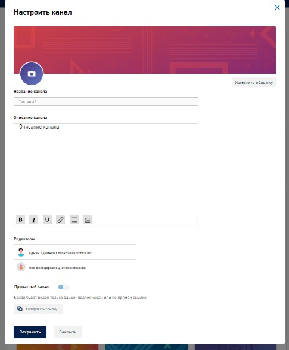
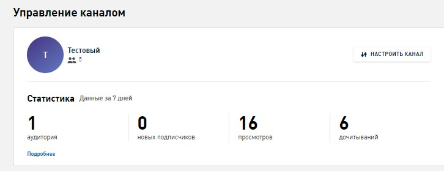
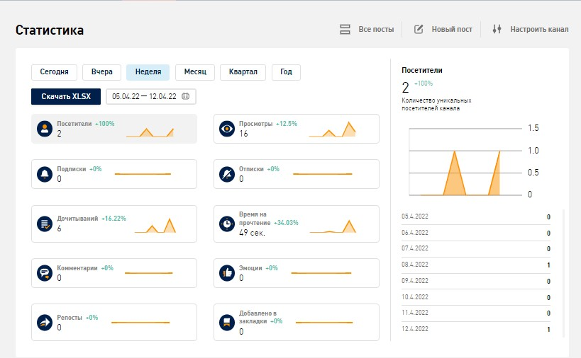
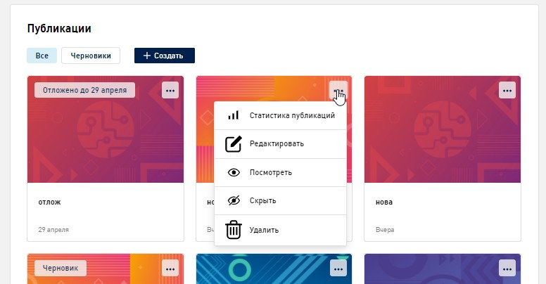
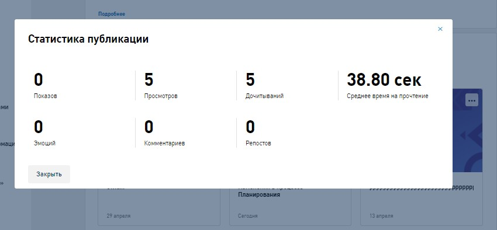
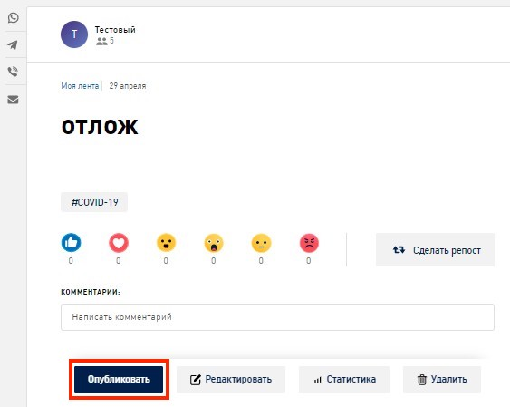
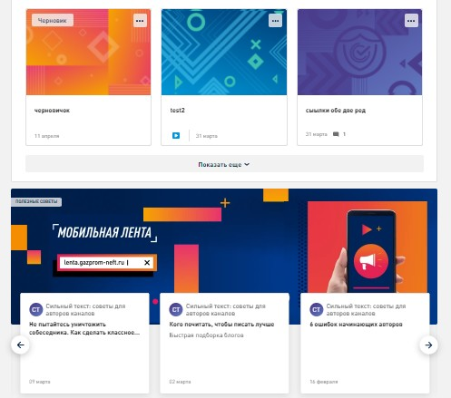
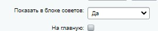

# Управление каналом

## Настроить канал

### Информационные разделы

* **Название канала.** Пользователь называет канал во время его создания
* **Редакторы.** Пользователи имеющие доступ к редактированию публикации

### Доступные настройки

* **Выбор/Загрузка логотипа.** При переходе можно выбрать предустановленные логотипы или загрузить свой. Загруженные изображения пережимаются в круг
* **Выбор/Загрузка обложки (баннер в шапке).** При переходе можно выбрать предустановленную обложку или загрузить свою.
* **Описание канала.** Текстовое поле с сокращенным редактором без меток
* **[Тумблер](../glossary/glossary.md#тумблер--переключатель-между-двумя-состояниями-вклвыкл) «Приватный канал».** Приватный канал будет доступен только текущим подписчикам, новые смогут подписаться по ссылке вида `lenta.gazprom-neft.ru/channel/testovyy/406290596884d257d155a7eae8d74b26s`

> Для обеспечения безопасности код меняется каждый раз при переключении тумблера. Через поиск такой канал и его публикации найти может только подписчик

* **Сохранить.** Сохранение изменений

* **Закрыть.** Закрывает форму без сохранения изменений

## Статистика

### Статистика включает в себя информацию за последние 7 дней

* **Аудитория.** Количество читателей
* **Новые подписчики.** Количество новых читателей
* **Просмотры.** Количество просмотров публикаций
* **Дочитывания.** Количество полностью прочитанных публикаций

> При нажатии «Подробнее» открывается окно с полной статистикой публикаций

## Публикации

### Разделы публикаций

* **Опубликованные**
* **Скрытые (черновики).** Помечаются специальной [плашкой](../glossary/glossary.md#плашки-–-прямоугольники-на-фоне-залитые-цветом-которые-стоят-под-всеми-объектами-или-частично), можно отобрать по фильтру
* **Отложенные.** Помечаются специальной [плашкой](../glossary/glossary.md#плашки-–-прямоугольники-на-фоне-залитые-цветом-которые-стоят-под-всеми-объектами-или-частично), выводятся первые в списке
* **Публикации, которые автор репостнул из другого канала.** Помечены иконкой «Репост»

### Действия по клику на публикацию

> Также доступны из шаблона просмотра

* **Статистика публикаций.** [Попап](../glossary/glossary.md#попап-pop-up-–-всплывающее-окно-которое-появляется-во-время-посещения-страницы) с основными показателями статистики новости

* **Редактировать.** Открытие формы редактирования
* **Посмотреть.** Шаблон просмотра активной публикации отличается от обычного шаблона тем, что в нижней панели отображается «Опубликовать» вместо «Скрыть»

* **Скрыть.** Публикация переходит в раздел «Черновики»
* **Удалить.** Публикация удаляется из публичной части посредством мягкого удаления (хранится в системе в деактивированном виде)

> Мягкое удаление - это метод, при котором данные помечаются как удаленные, но остаются в системе для возможного восстановления или анализа

## Полезные советы

Внизу страницы управления каналом есть блок «Полезные советы» с баннером и слайдером постов

Добавить публикацию можно через админку, отметив «Да» в свойстве «Показать в блоке советов»

