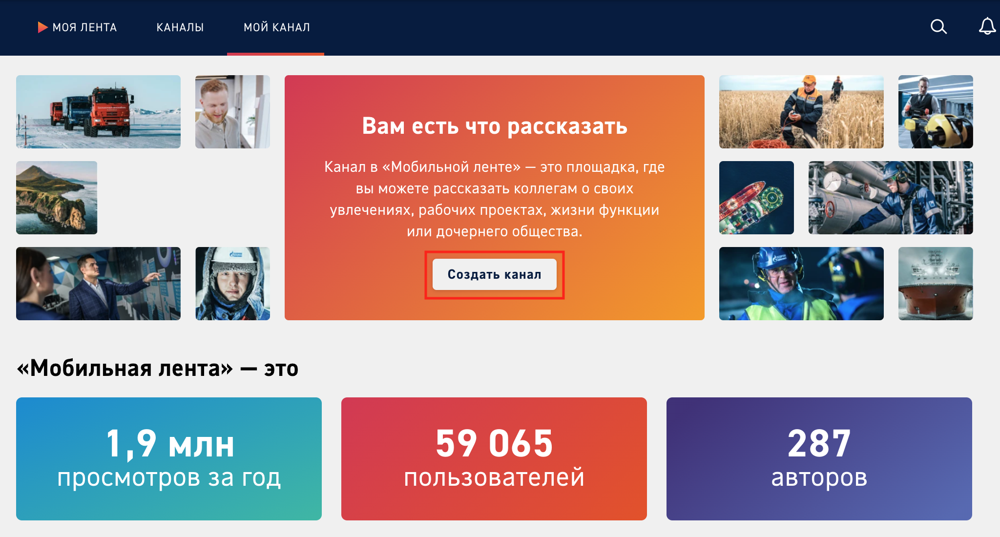
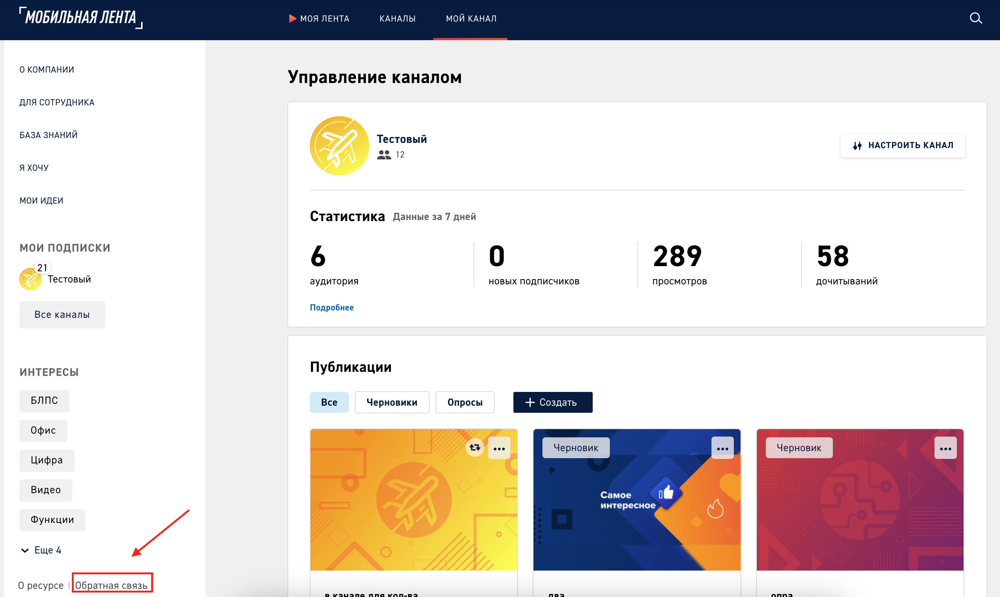
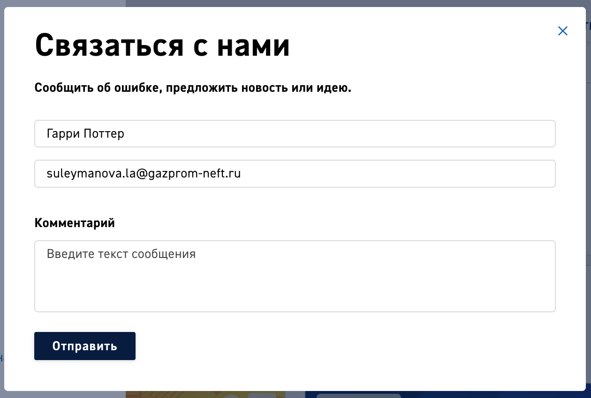
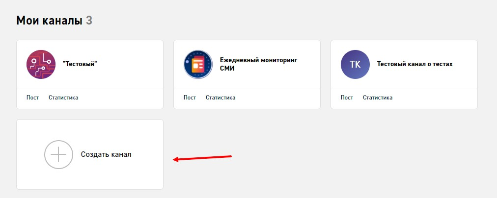
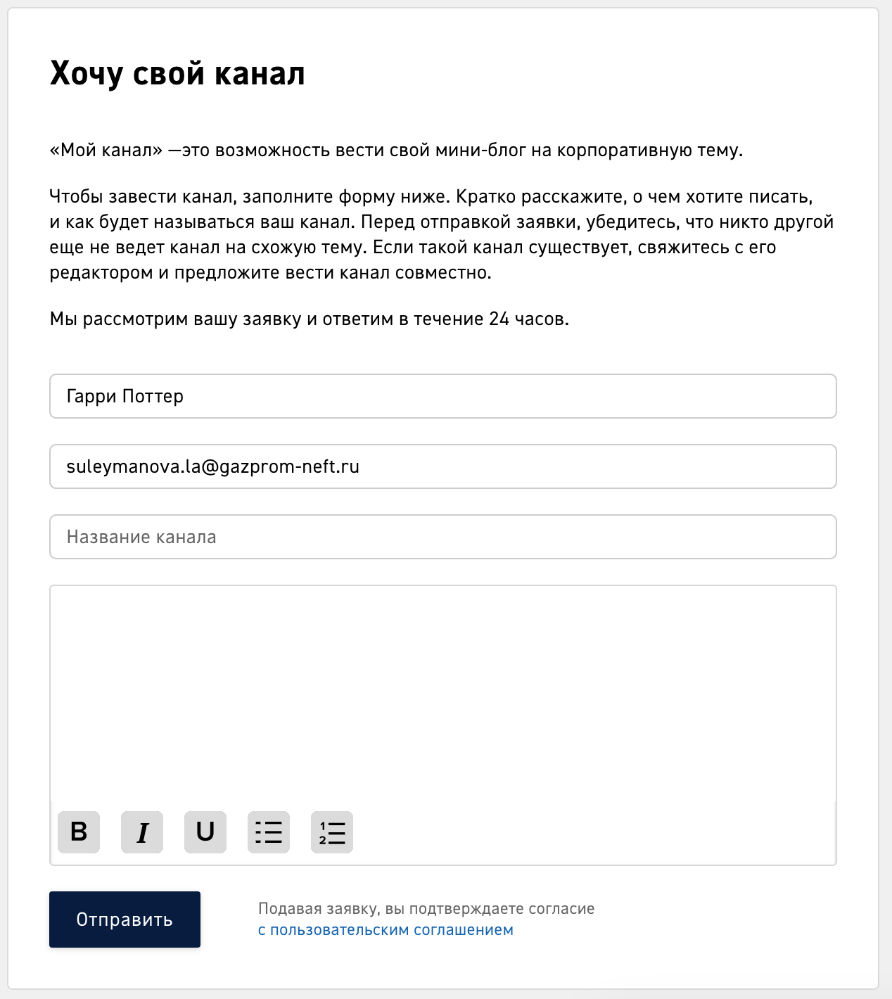

# Создание канала

## Раздел «Мой канал»

Новый канал создается в разделе «Мой канал». В зависимости от количества каналов у пользователя, способ создания канала отличается

* **Если у пользователя нет созданных каналов**, то при переходе в раздел «Мой канал» откроется страница с информацией о сервисе с разделами «Вам есть что рассказать», ««Мобильная лента» – это», «Что ждет вас в ленте» и так далее. 

    Для создания канала нужно кликнуть «Создать канал»

* **Если у пользователя один канал**, то для создание нового канала пользователь должен подать заявку через форму обратной связи

В форме автоматически заполняются Имя и E-mail пользователя, необходимо заполнить раздел «Комментарий» указав причину связи, название и описание будущего канала

Отправленная заявка приходит на почту портала, в разделе «Каналы» создается канал с указанным названием и описанием. Пользователь автоматически привязывается владельцем канала. Для того, чтобы одобрить заявку нужно активировать этот раздел

После активации канала пользователь видит его в разделе «Мой канал»

* **Если у пользователя несколько каналов**, то при переходе в раздел «Мой канал» открывается список существующих каналов и кнопка «Создать канал»

## Форма «Хочу свой канал»

В форме представлено краткое описание к требованиям заполнения и сроки рассмотрения заявки

Форма состоит из следующих разделов

* **Имя пользователя.** Заполняется автоматически

* **E-mail пользователя.** Заполняется автоматически

* **Название канала.** Заполняется пользователем

* **Описание канала.** Текстовое поле с сокращенным редактором без меток. Заполняется пользователем

