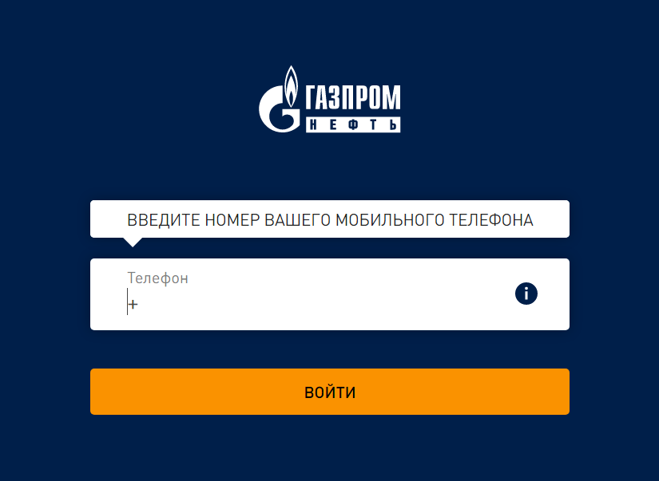
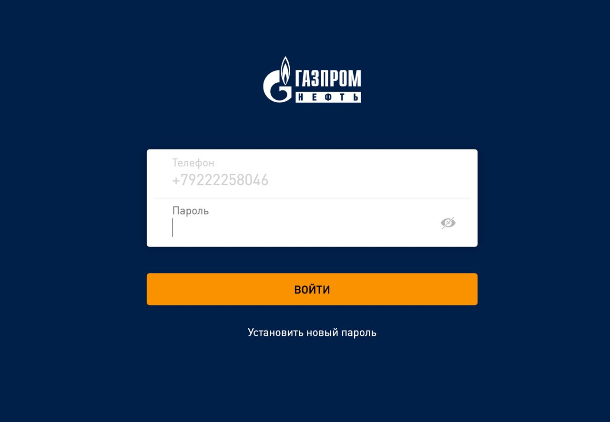
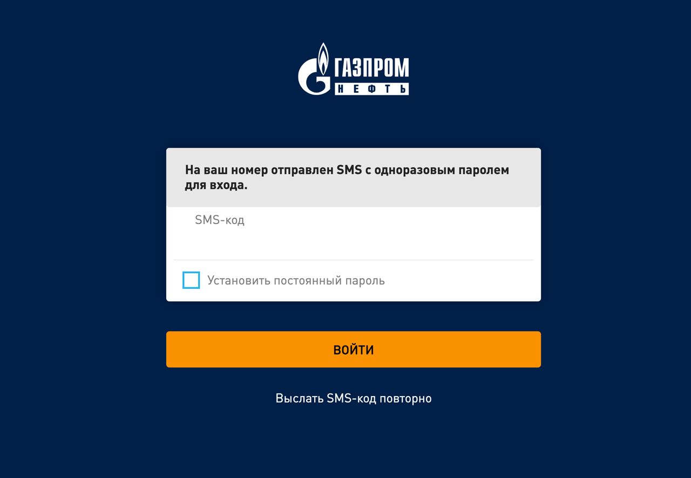
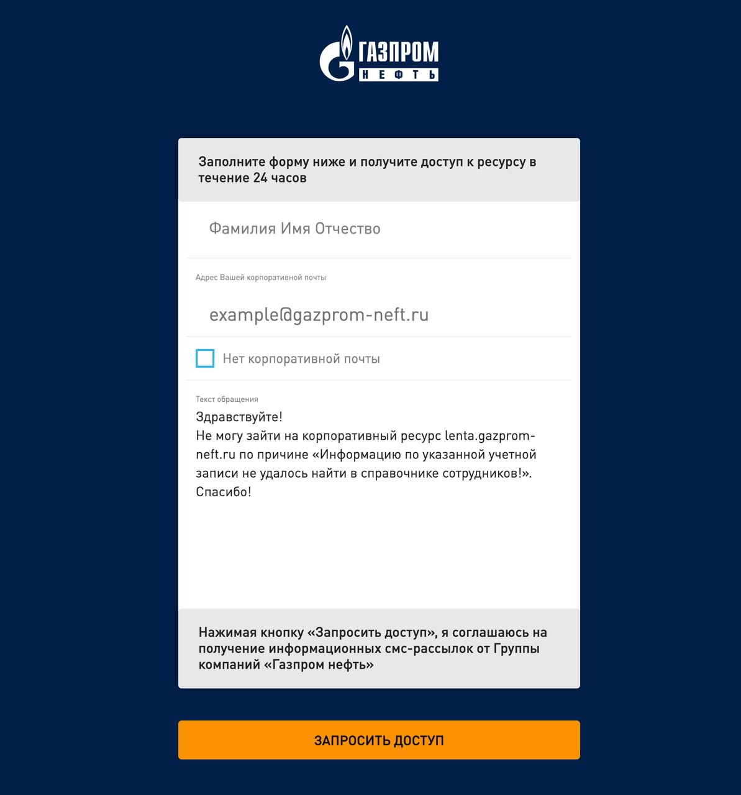

# Как авторизоваться на портале и получить доступ к Мобильной ленте?

1. Перейдите по ссылке <https://lenta.gazprom-neft.ru>

2. Авторизация на портале происходит по номеру телефона. Если вы работаете в структуре ГПН и у вас уже есть пароль для входа, сначала введите ваш телефон.

    

3. Если телефон указан верно, появится второе поле, в которое нужно ввести пароль

    

4. Если введенный пароль не подходит, или вы его не помните, нажмите ссылку «Установить новый пароль». На указанный номер телефона придет SMS с одноразовым паролем, который можно ввести в открывшуюся строку. Поставив галочку в строке ниже, вы можете установить этот пароль в качестве постоянного.

    

5. Если ваш телефонный номер отсутствует в базе сайта, заполните предложенную форму: введите необходимую информацию и нажмите кнопку «Запросить доступ». В течение 24 часов вы получите доступ к Мобильной ленте.

    