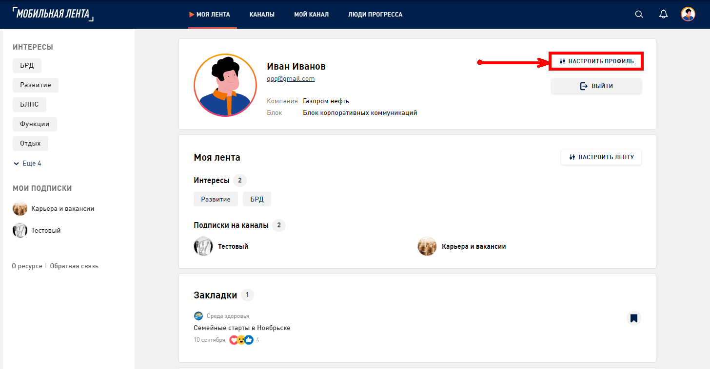

# Настройка профиля

В вашем профиле хранится не только информация о вас, ваши подписки, закладки, но и вся история вашей активности в Мобильной ленте - публикации, комментарии, лайки и др. Настройте свой Профиль, чтобы наш портал подбирал и показывал для вас полезные новости.

1. Перейдите в раздел «Профиль» в шапке страницы или откройте его по ссылке https://lenta.gazprom-neft.ru/profile/

2. Чтобы отредактировать информацию в своем профиле нажмите «Настроить профиль»

](../assets/profile-settings-1.png)

3. В форме для редактирования профиля вы можете:
* **Изменить имя**. Введите ваше имя в поля Ф.И.О
* **Изменить email**. Введите адрес электронной почты в поле “Ваш email”
* **Указать место работы**. В выпадающем списке “Компания” выберите свою компанию
* **Указать подразделение**. В выпадающем списке Блок выберите свое подразделение

](../assets/profile-settings-2.png)

* **Добавить или изменить аватар**. Нажмите «Добавить аватар» и загрузите свое изображение, фото или выберите картинку из предложенных, нажмите «Сохранить»

](../assets/profile-settings-3.png)

4. Чтобы сохранить ваши настройки и внесенные изменения в Профиле, нажмите «Сохранить»
